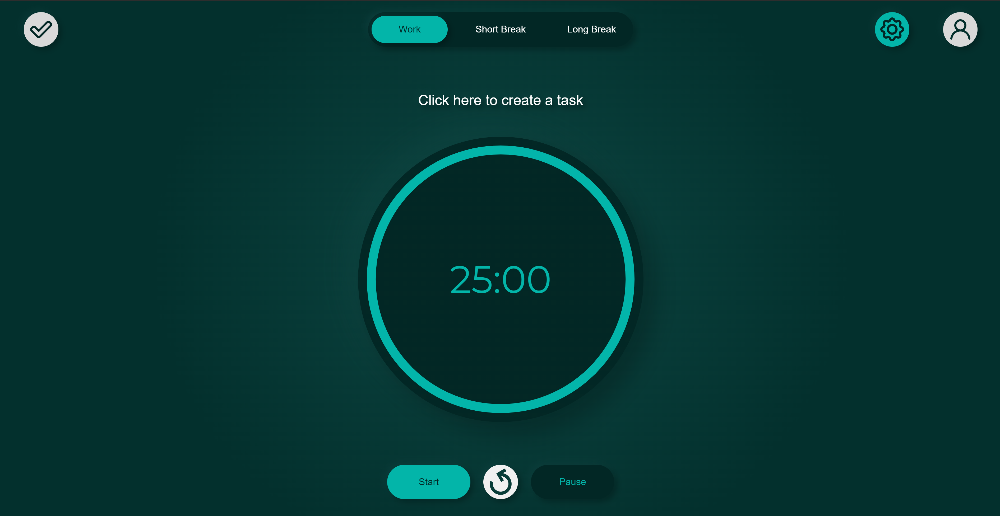

# Nucleus Pomodoro

> A pomodoro timer with fully customizable settings while allowing it's users' to create projects with tasks associated to them.

## Table of contents

- [General info](#general-info)
- [Technologies](#technologies)
- [Setup](#setup)
- [Features](#features)
- [Status](#status)
- [Inspiration](#inspiration)
- [License](#license)
- [Contact](#contact)

## General info

This project aims to help the user increase their productivity by allowing them to focus on a single task at a time using the Pomodoro technique. For more information on the Pomodoro technique, please read the following article by [Todoist](https://todoist.com/productivity-methods/pomodoro-technique).

## Technologies

- ReactJS
- Auth0
- SASS
- Bootstrap

## Setup

Clone the repository:

~~~linux
git clone https://github.com/ric-ram/nucleus-pomodoro.git
cd nucleus-pomodoro
~~~

Install dependencies:

~~~linux
npm install
~~~

Update de environment variables with your own:

~~~txt
#.env
REACT_APP_AUTH0_DOMAIN=your-auth0-domain
REACT_APP_AUTH0_CLIENT_ID=your-auth0-client-id
REACT_APP_AUTH0_API_ID=your-auth0-api-id
REACT_APP_API_URI=your-api-uri
~~~

After updating the environment variables, you can run the app in development:

~~~linux
npm start
~~~

Open <http://localhost:3000> to view it in the browser.

The page will reload if you make edits.

You will also see any lint errors in the console.

## Features

Current features:

- Fully customizable timer
- Sign in/Sign Up & account management
- Project/Task creation & management

To-do list:

- [ ] Implement a modal to warn users of possible bugs during the staging phase.
- [ ] Fix bugs:
  - [ ] Fix empty page after project creation
  - [ ] Disable task focus after being completed
  - [ ] Fix automatic refresh and logout when the database is updated
  - [ ] Reset timer after changing task
  - [ ] If refreshed, it always requires to login
- [ ] Add Pomodoro count for each task
- [ ] Add hover behavior for buttons for a better UX
- [ ] Do more extensive testing

## Status

Currently, the project is in the _staging_ phase. As seen in the segment before, there are still some bugs to fix and more features to implement. Therefore, I'll be updating the project in the following months.

## Inspiration

The inspiration for this project came from the [nesto](https://nesto.cc/) Pomodoro app. It's an app I've used while going through my tasks, including developing this project. I decided to create my own due to some of the features I find necessary for my workflow still being under development or only available to premium users.

## License

MIT License.

You can create your own Pomodoro app for free without notifying me by forking this project under the following conditions:

- Add a link to my original app

Check out LICENSE for more detail.

## Contact

Created by [Ricardo Ramos](https://github.com/ric-ram/) - feel free to contact me via email at [r.ramos@ricardoframos.com](mailto:ramos@ricardoframos.com)
